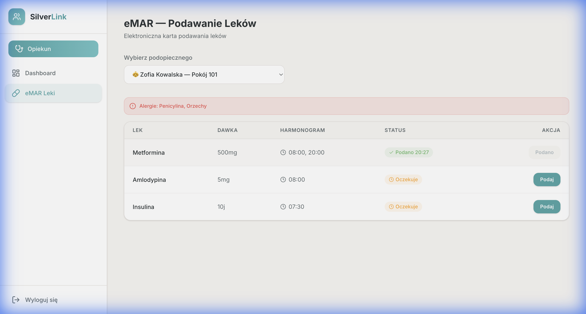
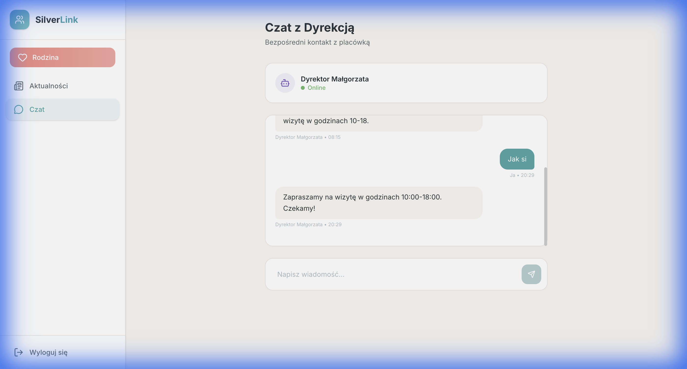
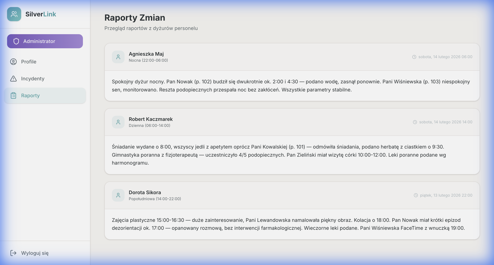

# SilverLink MVP — Pełna Dokumentacja i Prezentacja

## 📸 Pełna Prezentacja Systemu (Wideo)

Poniższe nagranie przedstawia kompletną ścieżkę użytkownika dla wszystkich trzech ról (Opiekun, Rodzina, Admin), w tym system One-Tap ADL, eMAR, Chat oraz Raporty.

---

## 📸 Kluczowe Moduły

### 1. eMAR — Bezpieczeństwo Lekowe
System zapobiega pomyłkom dzięki czytelnym alertom o alergiach i śledzeniu czasu podania leków w czasie rzeczywistym.

### 2. Portal Rodziny — Spokój i Kontakt
Rodziny mogą śledzić codzienne aktywności bliskich oraz komunikować się bezpośrednio z dyrekcją poprzez czat z automatycznym asystentem.

### 3. Panel Admina — Pełna Kontrola
Centralne miejsce do zarządzania profilami seniorów, logowania incydentów oraz przeglądania raportów zmianowych personelu.

---

## Finalne Ustawienia UX
- **Technologia:** React + Tailwind CSS 4.
- **Layout:** Elastyczny system Flexbox (brak nakładania się sidebaru).
- **Design:** Modernistyczny, z dużymi marginesami i wysokim kontrastem dla lepszej czytelności.
